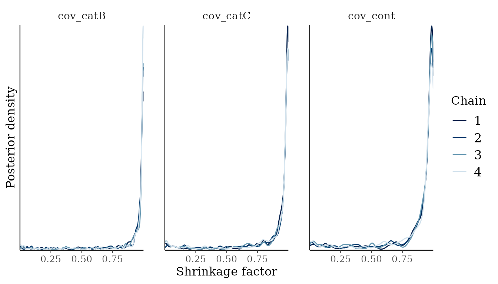
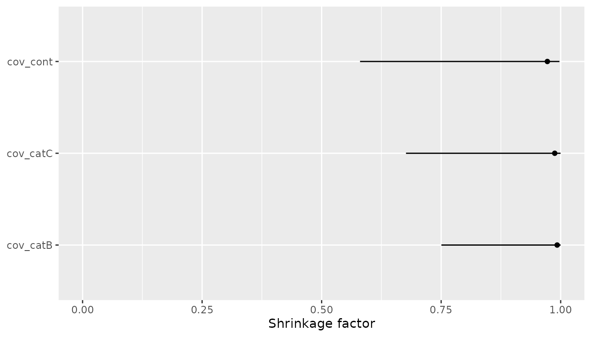

# Covariate Selection with the Horseshoe Prior

## Overview

Covariate selection in joint models is often difficult because each
candidate covariate can interact with the survival model, the
longitudinal model, and the association between them. The regularized
horseshoe prior provides a Bayesian shrinkage approach: include the
candidate covariates in one model, shrink most survival coefficients
strongly towards zero, and allow a smaller number of coefficients to
escape that shrinkage when supported by the data.

In `jmpost`, this workflow is available for the survival covariate
coefficients through
[`prior_horseshoe()`](https://genentech.github.io/jmpost/reference/prior_horseshoe.md).
This vignette starts from the prior specification and then shows a
complete joint model example in which the survival covariates use the
horseshoe prior. The fitted model can be inspected through the posterior
coefficient draws and through the shrinkage factors extracted with
[`shrinkage()`](https://genentech.github.io/jmpost/reference/shrinkage.md).

## Theory

The horseshoe prior is a global-local shrinkage prior ([Carvalho,
Polson, and Scott 2010](#ref-CarvalhoEtAl2010)). A global parameter
shrinks all coefficients towards zero, while coefficient-level local
parameters allow selected coefficients to remain large. The regularized
horseshoe ([Piironen and Vehtari 2017](#ref-PiironenVehtari2017)) adds a
slab component that regularizes coefficients that escape the main
shrinkage. This is the parameterization used by `jmpost`, following the
same notation as `brms` ([Bürkner 2017](#ref-Buerkner2017)). Details are
provided in the statistical specifications vignette
[here](https://genentech.github.io/jmpost/articles/statistical-specification.md).

The hyperparameters map to
[`prior_horseshoe()`](https://genentech.github.io/jmpost/reference/prior_horseshoe.md)
arguments as follows:

- `df`: local degrees of freedom, $`\nu_{\lambda}`$
- `df_global`: global degrees of freedom, $`\nu_{\tau}`$
- `df_slab`: slab degrees of freedom, $`\nu_c`$
- `scale_global`: global scale, $`s_{\tau}`$
- `scale_slab`: slab scale, $`s_c`$

The local shrinkage parameters $`\lambda_j`$ let individual coefficients
escape the global shrinkage $`\tau`$. The slab scale $`s_c`$ and slab
degrees of freedom $`\nu_c`$ control how much very large coefficients
are regularized. Smaller $`s_{\tau}`$ values encode stronger prior
belief that only a small number of candidate covariates are relevant.

A useful posterior diagnostic is the shrinkage factor

``` math
\kappa_j =
\frac{1}{1 + \tau^2\lambda_j^2 / c^2}.
```

Values of $`\kappa_j`$ close to 1 indicate strong shrinkage towards
zero. Values close to 0 indicate little shrinkage. The shrinkage factor
should be read together with the coefficient posterior: it is evidence
about how strongly the prior-likelihood combination pulled a coefficient
towards zero, not a standalone posterior inclusion probability.

## Simulate Example Data

We first simulate data from a joint model with a random-slope
longitudinal submodel and a Weibull proportional hazards survival
submodel. The survival model contains one categorical and one continuous
candidate covariate. The categorical covariate contributes two columns
to the design matrix, so the survival model has three covariate
coefficients in total.

``` r

set.seed(129)
sim_data <- SimJointData(
    design = list(
        SimGroup(50, "Arm-A", "Study-X"),
        SimGroup(50, "Arm-B", "Study-X")
    ),
    longitudinal = SimLongitudinalRandomSlope(
        times = c(1, 20, 50, 100, 150, 200, 250, 300),
        intercept = 30,
        slope_mu = c(1, 2),
        slope_sigma = 0.2,
        sigma = 20,
        link_dsld = 0.1
    ),
    survival = SimSurvivalWeibullPH(
        lambda = 1 / 300,
        gamma = 0.97,
        time_max = 2000,
        time_step = 1,
        lambda_cen = 1 / 9000,
        beta_cat = c(
            "A" = 0,
            "B" = 0.3,
            "C" = 0.7
        ),
        beta_cont = 0.3
    )
)
```

Then we prepare the corresponding objects:

``` r

os_data <- sim_data@survival
long_data <- sim_data@longitudinal

joint_data <- DataJoint(
    subject = DataSubject(
        data = os_data,
        subject = "subject",
        arm = "arm",
        study = "study"
    ),
    survival = DataSurvival(
        data = os_data,
        formula = Surv(time, event) ~ cov_cat + cov_cont
    ),
    longitudinal = DataLongitudinal(
        data = long_data,
        formula = sld ~ time,
        threshold = 5
    )
)
```

Before setting priors or interpreting the output, it is a good habit to
check the survival design matrix. With
[`covariates()`](https://genentech.github.io/jmpost/reference/covariates.md)
we can access the column names, which map to the corresponding survival
coefficients that receive the horseshoe prior.

``` r

head(model.matrix(joint_data@survival))
#>      cov_catB cov_catC   cov_cont
#> [1,]        1        0 -1.1209000
#> [2,]        0        1 -0.9897245
#> [3,]        0        1 -1.3746970
#> [4,]        0        1 -1.3556451
#> [5,]        1        0  1.9967553
#> [6,]        1        0  0.6958700
survival_covariates <- covariates(joint_data@survival)
survival_covariates
#> [1] "cov_catB" "cov_catC" "cov_cont"
```

## Fit a Joint Model

Now we define a joint model. The longitudinal model and the association
link use standard priors. The survival model uses
[`prior_horseshoe()`](https://genentech.github.io/jmpost/reference/prior_horseshoe.md)
for the vector of survival covariate coefficients:

``` r

joint_model <- JointModel(
    longitudinal = LongitudinalRandomSlope(),
    survival = SurvivalWeibullPH(
        beta = prior_horseshoe(
            df = 1,
            df_global = 1,
            df_slab = 4,
            scale_global = 0.3,
            scale_slab = 2
        )
    ),
    link = linkDSLD()
)
```

The choice above uses half-Cauchy priors for the local and global
shrinkage parameters, because `df = 1` and `df_global = 1`. The
relatively small `scale_global = 0.3` favours sparse survival effects in
this small example, while `scale_slab = 2` still allows meaningfully
large log-hazard coefficients when the data support them.

The following code fits the model. In a serious analysis, increase the
number of warmup and sampling iterations and check convergence
carefully.

``` r

fit <- sampleStanModel(
    joint_model,
    data = joint_data,
    iter_warmup = 500,
    iter_sampling = 500,
    chains = 4,
    parallel_chains = 4,
    seed = 325,
    refresh = 0,
    show_exceptions = FALSE,
    show_messages = FALSE
)
#> Warning: 102 of 2000 (5.0%) transitions ended with a divergence.
#> See https://mc-stan.org/misc/warnings for details.
```

## Inspect Coefficients

After fitting, let’s inspect the coefficient posterior and standard MCMC
diagnostics. The survival covariate coefficients are stored in
`beta_os_cov`.

``` r

stan_fit <- cmdstanr::as.CmdStanMCMC(fit)

stan_fit$summary(
    variables = c(
        "beta_os_cov",
        "prior_global_beta_os_cov",
        "prior_slab_beta_os_cov"
    )
)
#> # A tibble: 5 × 10
#>   variable         mean median    sd   mad      q5   q95  rhat ess_bulk ess_tail
#>   <chr>           <dbl>  <dbl> <dbl> <dbl>   <dbl> <dbl> <dbl>    <dbl>    <dbl>
#> 1 beta_os_cov[1]  0.112 0.0566 0.190 0.129 -0.128  0.485  1.00     991.    1058.
#> 2 beta_os_cov[2]  0.209 0.157  0.242 0.224 -0.0757 0.684  1.01     600.    1049.
#> 3 beta_os_cov[3]  0.302 0.305  0.121 0.124  0.0914 0.492  1.01     716.     349.
#> 4 prior_global_b… 0.485 0.279  0.973 0.228  0.0621 1.41   1.00     733.     694.
#> 5 prior_slab_bet… 1.83  1.13   2.85  0.788  0.412  4.95   1.00    1450.     975.
```

The coefficient names come from the design matrix:

``` r

beta_summary <- stan_fit$summary("beta_os_cov")
beta_summary$covariate <- survival_covariates
beta_summary[, c("covariate", "median", "q5", "q95", "rhat", "ess_bulk")]
#> # A tibble: 3 × 6
#>   covariate median      q5   q95  rhat ess_bulk
#>   <chr>      <dbl>   <dbl> <dbl> <dbl>    <dbl>
#> 1 cov_catB  0.0566 -0.128  0.485  1.00     991.
#> 2 cov_catC  0.157  -0.0757 0.684  1.01     600.
#> 3 cov_cont  0.305   0.0914 0.492  1.01     716.
```

Coefficients whose posterior remains close to zero and whose shrinkage
factors are close to 1 are natural candidates to treat as weakly
supported covariates. Coefficients whose posterior is away from zero and
whose shrinkage factors are closer to 0 have escaped shrinkage and are
more strongly supported by the model.

## Extract and Plot Shrinkage Factors

Let’s use the
[`shrinkage()`](https://genentech.github.io/jmpost/reference/shrinkage.md)
function to extract the posterior draws of $`\kappa_j`$. The returned
draws are named with the survival covariate names, so they can be
plotted or summarised directly.

``` r

shrinkage_draws <- shrinkage(fit)
posterior::variables(shrinkage_draws)
#> [1] "cov_catB" "cov_catC" "cov_cont"

summary(shrinkage_draws)
#> # A tibble: 3 × 10
#>   variable  mean median    sd    mad    q5   q95  rhat ess_bulk ess_tail
#>   <chr>    <dbl>  <dbl> <dbl>  <dbl> <dbl> <dbl> <dbl>    <dbl>    <dbl>
#> 1 cov_catB 0.916  0.993 0.201 0.0107 0.379 1.000  1.01     601.     521.
#> 2 cov_catC 0.894  0.988 0.225 0.0180 0.232 1.000  1.01     619.     818.
#> 3 cov_cont 0.872  0.972 0.233 0.0367 0.214 0.999  1.00     549.     432.
```

One compact visual summary is a density plot of the shrinkage factors.

``` r

library(bayesplot)
#> This is bayesplot version 1.15.0
#> - Online documentation and vignettes at mc-stan.org/bayesplot
#> - bayesplot theme set to bayesplot::theme_default()
#>    * Does _not_ affect other ggplot2 plots
#>    * See ?bayesplot_theme_set for details on theme setting

mcmc_dens_overlay(shrinkage_draws) +
    ggplot2::labs(
        x = "Shrinkage factor",
        y = "Posterior density"
    )
```



We see that both coefficients for the categorical covariate have
shrinkage factors near 1, while the continuous covariate’s shrinkage
factor is a bit more distributed towards smaller values.

A second useful display is the median shrinkage factor with an interval
for each covariate:

``` r

library(dplyr)
library(ggplot2)

shrinkage_summary <- posterior::summarise_draws(
    shrinkage_draws,
    median,
    ~ quantile(.x, 0.1),
    ~ quantile(.x, 0.9)
) |>
    dplyr::rename(q10 = `10%`, q90 = `90%`)

ggplot(shrinkage_summary, aes(x = median, y = variable)) +
    geom_errorbar(aes(xmin = q10, xmax = q90), width = 0) +
    geom_point() +
    scale_x_continuous(limits = c(0, 1)) +
    labs(
        x = "Shrinkage factor",
        y = NULL
    )
```



## Interpret the Output

In this simulated example, the design matrix contains `cov_catB`,
`cov_catC`, and `cov_cont`. The data were generated with a small effect
for `cov_catB`, a larger positive effect for `cov_catC`, and a moderate
positive effect for `cov_cont`.

The horseshoe analysis should therefore be interpreted along these
lines:

- A shrinkage factor near 1 for `cov_catB`, combined with a coefficient
  posterior close to zero, would indicate that the model sees little
  evidence for that weak covariate.
- Smaller shrinkage factors for `cov_catC` and `cov_cont`, combined with
  coefficient posteriors away from zero, would indicate that these
  covariates escaped the global shrinkage.
- Intermediate shrinkage factors should be treated as uncertainty, not
  as an automatic include/exclude decision.

The practical decision is still scientific. The regularized horseshoe
helps rank and regularize many candidate covariates in a single joint
model fit, but final selection should also consider prior clinical
plausibility, multiplicity of candidate transformations, model
diagnostics, and posterior predictive performance.

## Practical Guidance

The global scale is the main sparsity control. Smaller `scale_global`
values expect fewer relevant covariates; larger values allow more
coefficients to remain away from zero. In applied work, this choice
should reflect the number of candidate covariates and the expected
number of non-negligible effects.

The slab scale should be large enough for plausible survival effects but
not so large that implausible log-hazard ratios are effectively
unregularized. For standardized continuous covariates, a `scale_slab`
around 2 is often already wide on the log-hazard scale. For
unstandardized covariates, first consider whether the covariate scale
itself should be transformed or standardized.

Finally, the horseshoe prior is a shrinkage prior, not a replacement for
model checking. Always inspect convergence diagnostics, posterior
predictive fit, and sensitivity to reasonable prior choices before using
the selected covariates for scientific conclusions.

## References

Bürkner P-C (2017). “brms: An R Package for Bayesian Multilevel Models
Using Stan.” *Journal of Statistical Software*, **80**(1), 1–28.
[https://doi.org/10.18637/jss.v080.i01.](https://doi.org/10.18637/jss.v080.i01)

Carvalho CM, Polson NG, Scott JG (2010). “The Horseshoe Estimator for
Sparse Signals.” *Biometrika*, **97**(2), 465–480.
[https://doi.org/10.1093/biomet/asq017.](https://doi.org/10.1093/biomet/asq017)

Piironen J, Vehtari A (2017). “Sparsity Information and Regularization
in the Horseshoe and Other Shrinkage Priors.” *Electronic Journal of
Statistics*, **11**(2), 5018–5051.
[https://doi.org/10.1214/17-EJS1337SI.](https://doi.org/10.1214/17-EJS1337SI)
