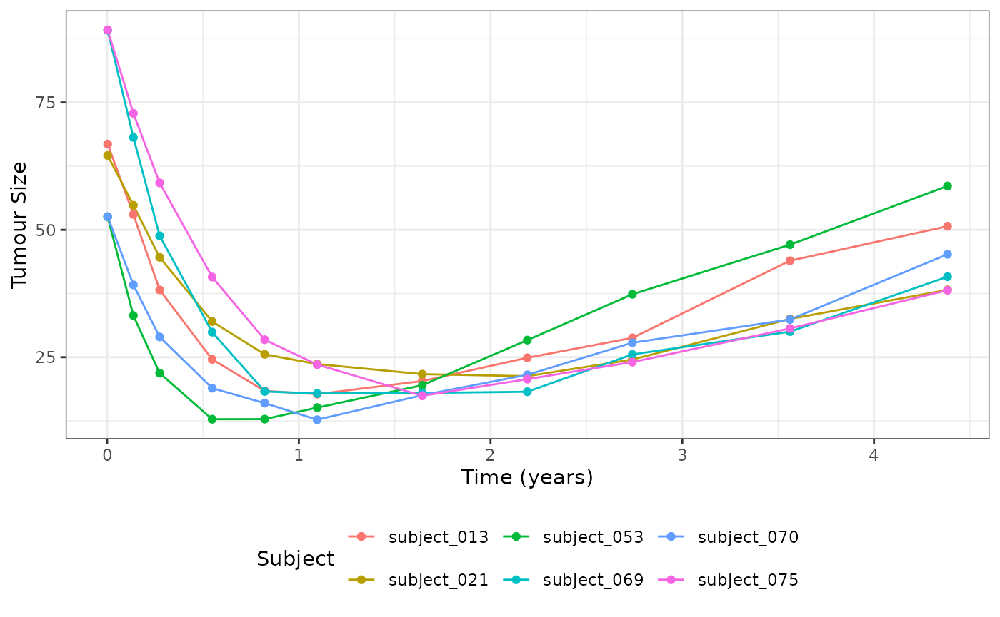
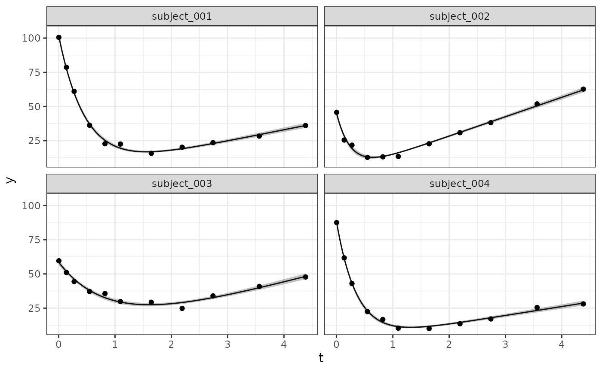
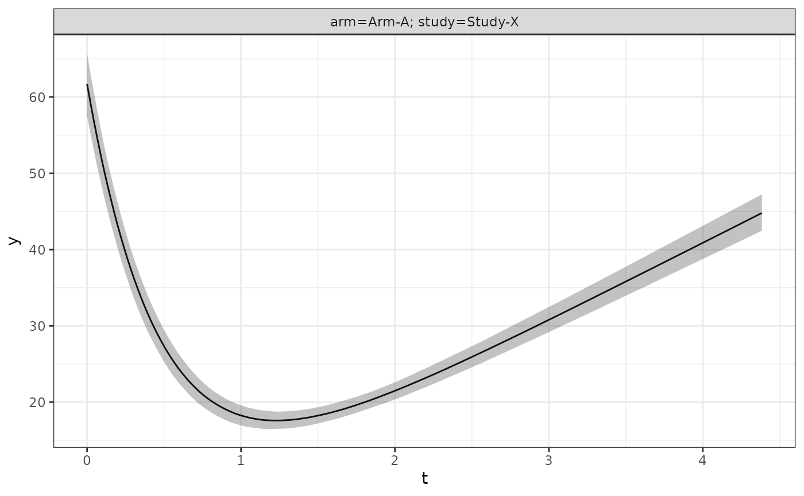

# Fitting a Custom Longitudinal Model

## Introduction

This vignette shows a complete example for how to fit a custom
longitudinal model. Note that full details for the various different
interfaces can be found in the “Extending jmpost” vignette. This example
implements the Wang, Sung et al. 2009 mixed exponential decay and linear
growth model along with an exponential survival model. In particular the
following model will be implemented:

**Longitudinal Model**:
``` math
\begin{align}
y_{i}(t) &\sim N\left(\mu_i(t),\ \sigma^2\right) \\ \\
\mu_i(t) &= b_i e^{-s_it} + g_i t  \\ \\
b_i &\sim \text{LogNormal}(\mu_b,\ \sigma_b) \\
s_i &\sim \text{LogNormal}(\mu_s,\ \sigma_s) \\
g_i &\sim \text{LogNormal}(\mu_g,\ \sigma_g) \\
\end{align}
```

Where: \* $`i`$ is the subject index \* $`y_{i}(t)`$ is the observed
tumour size measurement for subject $`i`$ at time $`t`$ \* $`\mu_i(t)`$
is the expected tumour size measurement for subject $`i`$ at time $`t`$
\* $`b_i`$ is the subject baseline tumour size measurement \* $`s_i`$ is
the subject kinetics shrinkage parameter \* $`g_i`$ is the subject
kinetics tumour growth parameter \* $`\mu_{\theta}`$ is the population
mean for parameter $`\theta`$ \* $`\omega_{\theta}`$ is the population
standard deviation for parameter $`\theta`$.

**Survival Model**:
``` math
\log(h_i(t)) = \log(\lambda_0) + X_i \beta + G(t \mid b_i, s_i, g_i) 
```

Where:

- $`\lambda_0`$ is the baseline hazard rate. This is because for this
  example we are using an exponential survival model
  e.g. $`h_0(t) = \lambda_0`$
- $`t`$ is the event time
- $`G(.)`$ is a link function that maps the subjects tumour growth
  parameters to a contribution to the log-hazard function
- $`X_i`$ is the subjects covariate design matrix
- $`\beta`$ is the corresponding coefficients vector to scale the design
  matrix covariates contribution to the log-hazard function

For this example we will just consider the derivative of the growth
function as the link function, e.g.
``` math
G(t \mid b_i, s_i, g_i) = -s_i b_i e^{-s_i t} + g_i
```

To keep the example simple, a number of features that have been
implemented in the package’s\
internal models will be skipped; you may wish to consider adding these
if implementing this model in a real project. In particular the
following have been omitted from this example:

- Handling for censored observations (e.g. observations that are below
  the limit of quantification)
- Separate populations per study / arm
- Non-centred parameterisation for the hierarchical parameters (this
  parameterisation leads to better performance if you have small numbers
  of observations per each subject).
- Handling negative observation time (e.g. observations that are taken
  before the start of the study)

For reference the following libraries will be used during this example:

``` r

library(jmpost)
#> Registered S3 methods overwritten by 'ggpp':
#>   method                  from   
#>   heightDetails.titleGrob ggplot2
#>   widthDetails.titleGrob  ggplot2
#> CmdStan path set to: /root/.cmdstan/cmdstan-2.39.0
library(ggplot2)
library(dplyr)
#> 
#> Attaching package: 'dplyr'
#> The following objects are masked from 'package:stats':
#> 
#>     filter, lag
#> The following objects are masked from 'package:base':
#> 
#>     intersect, setdiff, setequal, union
library(loo)
#> This is loo version 2.9.0
#> - Online documentation and vignettes at mc-stan.org/loo
#> - As of v2.0.0 loo defaults to 1 core but we recommend using as many as possible. Use the 'cores' argument or set options(mc.cores = NUM_CORES) for an entire session.
```

## Generating Simulated Data

In order to be confident that our model is working correctly we will
first generate some simulated data. This will allow us to compare the
true parameter values with the estimated parameter values. This can be
done using the `SimJointData` constructor function as follows:

``` r

# Define our simulation parameters + object
SimWang <- setClass(
    "SimWang",
    contains = "SimLongitudinal",
    slots = c(
        times = "numeric",
        mu_b = "numeric",
        mu_s = "numeric",
        mu_g = "numeric",
        omega_b = "numeric",
        omega_s = "numeric",
        omega_g = "numeric",
        sigma = "numeric",
        link_dsld = "numeric"
    )
)

# Method to generate individual subjects parameters from the hierarchical distributions
sampleSubjects.SimWang <- function(object, subjects_df) {
    nsub <- nrow(subjects_df)
    subjects_df$b <- stats::rlnorm(nsub, log(object@mu_b), object@omega_b)
    subjects_df$s <- stats::rlnorm(nsub, log(object@mu_s), object@omega_s)
    subjects_df$g <- stats::rlnorm(nsub, log(object@mu_g), object@omega_g)
    subjects_df
}

# Method to generate observations for each individual subject
sampleObservations.SimWang <- function(object, times_df) {
    nobs <- nrow(times_df)
    calc_mu <- function(time, b, s, g) b * exp(-s * time) + g * time
    calc_dsld <- function(time, b, s, g) -s * b * exp(-s * time) + g

    times_df$mu_sld <- calc_mu(times_df$time, times_df$b, times_df$s, times_df$g)
    times_df$dsld <- calc_dsld(times_df$time, times_df$b, times_df$s, times_df$g)
    times_df$sld <- stats::rnorm(nobs, times_df$mu_sld, object@sigma)
    times_df$log_haz_link <- object@link_dsld * times_df$dsld
    times_df
}


# Generate simulated data
set.seed(1622)
joint_data_sim <- SimJointData(
    design = list(SimGroup(80, "Arm-A", "Study-X")),
    survival = SimSurvivalExponential(
        lambda = (1 / 400) * 365,
        time_max = 4,
        time_step = 1 / 365,
        lambda_censor = 1 / 9000,
        beta_cat = c("A" = 0, "B" = -0.1, "C" = 0.5),
        beta_cont = 0.3
    ),
    longitudinal = SimWang(
        times = c(1, 50, 100, 200, 300, 400, 600,
                800, 1000, 1300, 1600) / 365,
        mu_b = 60,
        mu_s = 2,
        mu_g = 10,
        omega_b = 0.3,
        omega_s = 0.3,
        omega_g = 0.3,
        sigma = 1.5,
        link_dsld = 0.2
    ),
    .silent = TRUE
)

dat_lm <- joint_data_sim@longitudinal
dat_os <- joint_data_sim@survival


# Select 6 random subjects to plot
dat_lm_plot <- dat_lm |>
    filter(subject %in% sample(dat_os$subject, 6))

ggplot(dat_lm_plot, aes(x = time, y = sld, group = subject, color = subject)) +
    geom_line() +
    geom_point() +
    labs(x = "Time (years)", y = "Tumour Size", col = "Subject") +
    theme_bw() + 
    theme(legend.position = "bottom")
```



## Defining the Longitudinal Model

The longitudinal model can be implemented by extending the
`LongitudinalModel` class. This can be done as follows:

``` r

WangModel <- setClass(
    "WangModel",
    contains = "LongitudinalModel"
)

longmodel <- WangModel(
    LongitudinalModel(
        name = "Wang",
        stan = StanModule("custom-model.stan"),
        parameters = ParameterList(
            Parameter(name = "mu_baseline", prior = prior_lognormal(log(60), 1), size = 1),
            Parameter(name = "mu_shrinkage", prior = prior_lognormal(log(2), 1), size = 1),
            Parameter(name = "mu_growth", prior = prior_lognormal(log(10), 1), size = 1),
            Parameter(name = "sigma_baseline", prior = prior_lognormal(0.3, 1), size = 1),
            Parameter(name = "sigma_shrinkage", prior = prior_lognormal(0.3, 1), size = 1),
            Parameter(name = "sigma_growth", prior = prior_lognormal(0.3, 1), size = 1),
            Parameter(name = "sigma", prior = prior_lognormal(1.5, 1), size = 1),
            # The following is only required if we want jmpost to generate
            # initial values automatically for us
            Parameter(
                name = "baseline_idv",
                prior = prior_init_only(prior_lognormal(log(60), 1)),
                size = "n_subjects"
            ),
            Parameter(
                name = "shrinkage_idv",
                prior = prior_init_only(prior_lognormal(log(2), 1)),
                size = "n_subjects"
            ),
            Parameter(
                name = "growth_idv",
                prior = prior_init_only(prior_lognormal(log(10), 1)),
                size = "n_subjects"
            )
        )
    )
)
```

Please note that the `parameters` argument is used to specify the priors
for the model and that the `name` argument for the `Parameter`’s objects
must match the name of the parameter used within the corresponding Stan
code.

The `StanModule` object contains all of the stan code used to implement
the model. For this particular model the Stan code specified in the
`custom-model.stan` file is as follows:

``` stan

functions {
    // Expected tumour size value
    vector sld(vector tumour_time, vector baseline, vector shrinkage, vector growth) {
        vector[rows(tumour_time)] tumour_value;
        tumour_value = baseline .* exp(- shrinkage .* tumour_time)  +
                       growth .* tumour_time;
        return tumour_value;
    }
}

parameters{
    // Declare individual subject parameters
    vector<lower=0>[n_subjects] baseline_idv;
    vector<lower=0>[n_subjects] shrinkage_idv;
    vector<lower=0>[n_subjects] growth_idv;

    // Declare population level parameters
    real<lower=0> mu_baseline;
    real<lower=0> mu_shrinkage;
    real<lower=0> mu_growth;
    real<lower=0> sigma_baseline;
    real<lower=0> sigma_shrinkage;
    real<lower=0> sigma_growth;

    // Declare standard deviation for the overall model error
    real<lower=0> sigma;
}

transformed parameters{

    // Calculated the fitted Tumour values
    vector[n_tumour_all] Ypred = sld(
        tumour_time,
        baseline_idv[subject_tumour_index],
        shrinkage_idv[subject_tumour_index],
        growth_idv[subject_tumour_index]
    );

    // Calculate per observation log-likelihood for {loo} integration
    // These values are automatically added to the target for you
    long_obvs_log_lik = vect_normal_log_dens(
        tumour_value,
        Ypred,
        rep_vector(sigma, n_tumour_all) // broadcast sigma to the length of Ypred
    );
}

model {
    // Define the heirarchical relationship between the individual
    // and population level parameters
    baseline_idv ~ lognormal(log(mu_baseline), sigma_baseline);
    shrinkage_idv ~ lognormal(log(mu_shrinkage), sigma_shrinkage);
    growth_idv ~ lognormal(log(mu_growth), sigma_growth);
}
```

## Defining the Link Function

As stated in the introduction, the link function for this model is going
to be the derivative of the growth function. This can be implemented in
using the `jmpost` framework as follows:

``` r

enableLink.WangModel <- function(object, ...) {
    object@stan <- merge(
        object@stan,
        StanModule("custom-model-enable-link.stan")
    )
    object
}


link <- LinkComponent(
    stan = StanModule("custom-model-dsld.stan"),
    prior = prior_normal(0, 1),
    key = "link_dsld"
)
```

Where the Stan code for the `custom-model-enable-link.stan` file is as
follows:

``` stan
transformed parameters {
    // Define matrix required for link functions
    matrix[n_subjects, 3] link_function_inputs;
    link_function_inputs[,1] = baseline_idv;
    link_function_inputs[,2] = shrinkage_idv;
    link_function_inputs[,3] = growth_idv;
}
```

And the Stan code for the `custom-model-dsld.stan` file is as follows:

``` stan
functions {
    // Provide definition for the dsld link function
    matrix link_dsld_contrib(matrix time, matrix link_function_inputs) {
        int nrow = rows(time);
        int ncol = cols(time);
        // broadcast input vectors to match the size of the time matrix
        matrix[nrow, ncol] baseline = rep_matrix(link_function_inputs[,1], ncol);
        matrix[nrow, ncol] shrinkage = rep_matrix(link_function_inputs[,2], ncol);
        matrix[nrow, ncol] growth = rep_matrix(link_function_inputs[,3], ncol);
        return growth - baseline .* shrinkage .* exp(- shrinkage .* time);
    }
}
```

Note that as only one link function has been defined the `enableLink`
method is not strictly necessary and the Stan code it contains could
have been implemented directly in the `stan` slot of the `LinkComponent`
object. However, if you have multiple link functions the `enableLink`
method is required to avoid duplicating the implementation of the
`link_function_inputs` matrix.

## Sampling the Joint model

With our longitudinal model defined we can now specify and sample from
the full joint model.

``` r

model <- JointModel(
    longitudinal = longmodel,
    survival = SurvivalExponential(lambda = prior_gamma(1, 1)),
    link = link
)

joint_data <- DataJoint(
    subject = DataSubject(
        data = dat_os,
        subject = "subject",
        arm = "arm",
        study = "study"
    ),
    survival = DataSurvival(
        data = dat_os,
        formula = Surv(time, event) ~ cov_cat + cov_cont
    ),
    longitudinal = DataLongitudinal(
        data = dat_lm,
        formula = sld ~ time
    )
)

model_samples <- sampleStanModel(
    model,
    data = joint_data,
    iter_warmup = 800,
    iter_sampling = 1000,
    chains = 1,
    refresh = 0,
    parallel_chains = 1
)
#> Running MCMC with 1 chain...
#> Chain 1 Informational Message: The current Metropolis proposal is about to be rejected because of the following issue:
#> Chain 1 Exception: gamma_lpdf: Random variable is 0, but must be positive finite! (in '/tmp/Rtmp52Nwxd/model-b143f5ec4e1.stan', line 507, column 4 to column 79)
#> Chain 1 If this warning occurs sporadically, such as for highly constrained variable types like covariance matrices, then the sampler is fine,
#> Chain 1 but if this warning occurs often then your model may be either severely ill-conditioned or misspecified.
#> Chain 1
#> Chain 1 Informational Message: The current Metropolis proposal is about to be rejected because of the following issue:
#> Chain 1 Exception: gamma_lpdf: Random variable is 0, but must be positive finite! (in '/tmp/Rtmp52Nwxd/model-b143f5ec4e1.stan', line 507, column 4 to column 79)
#> Chain 1 If this warning occurs sporadically, such as for highly constrained variable types like covariance matrices, then the sampler is fine,
#> Chain 1 but if this warning occurs often then your model may be either severely ill-conditioned or misspecified.
#> Chain 1
#> Chain 1 Informational Message: The current Metropolis proposal is about to be rejected because of the following issue:
#> Chain 1 Exception: gamma_lpdf: Random variable is 0, but must be positive finite! (in '/tmp/Rtmp52Nwxd/model-b143f5ec4e1.stan', line 507, column 4 to column 79)
#> Chain 1 If this warning occurs sporadically, such as for highly constrained variable types like covariance matrices, then the sampler is fine,
#> Chain 1 but if this warning occurs often then your model may be either severely ill-conditioned or misspecified.
#> Chain 1
#> Chain 1 Informational Message: The current Metropolis proposal is about to be rejected because of the following issue:
#> Chain 1 Exception: lognormal_lpdf: Scale parameter is 0, but must be positive finite! (in '/tmp/Rtmp52Nwxd/model-b143f5ec4e1.stan', line 484, column 4 to column 63)
#> Chain 1 If this warning occurs sporadically, such as for highly constrained variable types like covariance matrices, then the sampler is fine,
#> Chain 1 but if this warning occurs often then your model may be either severely ill-conditioned or misspecified.
#> Chain 1
#> Chain 1 Informational Message: The current Metropolis proposal is about to be rejected because of the following issue:
#> Chain 1 Exception: gamma_lpdf: Random variable is 0, but must be positive finite! (in '/tmp/Rtmp52Nwxd/model-b143f5ec4e1.stan', line 507, column 4 to column 79)
#> Chain 1 If this warning occurs sporadically, such as for highly constrained variable types like covariance matrices, then the sampler is fine,
#> Chain 1 but if this warning occurs often then your model may be either severely ill-conditioned or misspecified.
#> Chain 1
#> Chain 1 finished in 9.9 seconds.

vars <- c(
    "mu_baseline", "mu_shrinkage", "mu_growth", "sigma",
    "link_dsld", "sm_exp_lambda"
)
cmdstanr::as.CmdStanMCMC(model_samples)$summary(vars)
#> # A tibble: 6 × 10
#>   variable       mean median     sd    mad     q5    q95  rhat ess_bulk ess_tail
#>   <chr>         <dbl>  <dbl>  <dbl>  <dbl>  <dbl>  <dbl> <dbl>    <dbl>    <dbl>
#> 1 mu_baseline  61.7   61.7   2.10   2.05   58.3   65.0   1.00     1630.     481.
#> 2 mu_shrinkage  2.04   2.04  0.0675 0.0658  1.93   2.15  1.000    1199.     721.
#> 3 mu_growth    10.2   10.2   0.288  0.279   9.75  10.7   1.00     1873.     690.
#> 4 sigma         1.52   1.52  0.0435 0.0441  1.45   1.60  1.00      863.     631.
#> 5 link_dsld     0.219  0.218 0.0260 0.0259  0.178  0.263 1.00     1527.     787.
#> 6 sm_exp_lamb…  1.01   0.998 0.207  0.207   0.682  1.36  0.999     850.     548.
```

## Generating Quantities of Interest

In order to enable the generation of both population and individual
level quantities of interest we need to implement the required generated
quantity objects and functions as outlined in the “Extending jmpost”
vignette.

This can be done as follows:

``` r

enableGQ.WangModel <- function(object, ...) {
    StanModule("custom-model-gq.stan")
}
```

Where the Stan code for the `custom-model-gq.stan` file is as follows:

``` stan

functions {
    // Define required function for enabling generated quantities
    vector lm_predict_value(vector time, matrix long_gq_parameters) {
        return sld(
            time,
            long_gq_parameters[,1],  // baseline
            long_gq_parameters[,2],  // shrinkage
            long_gq_parameters[,3]   // growth
        );
    }
}


generated quantities {
    // Enable individual subject predictions / quantities e.g.
    // `GridFixed()` / `GridObservation()` / `GridGrouped()` / `GridEven
    matrix[n_subjects, 3] long_gq_parameters;
    long_gq_parameters[, 1] = baseline_idv;
    long_gq_parameters[, 2] = shrinkage_idv;
    long_gq_parameters[, 3] = growth_idv;

    // Enable Population level predictions / quantities by taking the median of the
    // hierarchical distribution e.g. `GridPopulation()`
    matrix[gq_n_quant, 3] long_gq_pop_parameters;
    long_gq_pop_parameters[, 1] = rep_vector(mu_baseline, gq_n_quant);
    long_gq_pop_parameters[, 2] = rep_vector(mu_shrinkage, gq_n_quant);
    long_gq_pop_parameters[, 3] = rep_vector(mu_growth, gq_n_quant);
}
```

With the above in place we are now able to generate quantities as
needed; this can be done at the subject level via:

``` r

selected_subjects <- head(dat_os$subject, 4)
long_quantities_idv <- LongitudinalQuantities(
    model_samples,
    grid = GridFixed(subjects = selected_subjects)
)
autoplot(long_quantities_idv)
```



Or at the population level via:

``` r

long_quantities_pop <- LongitudinalQuantities(
    model_samples,
    grid = GridPopulation()
)
autoplot(long_quantities_pop)
```


