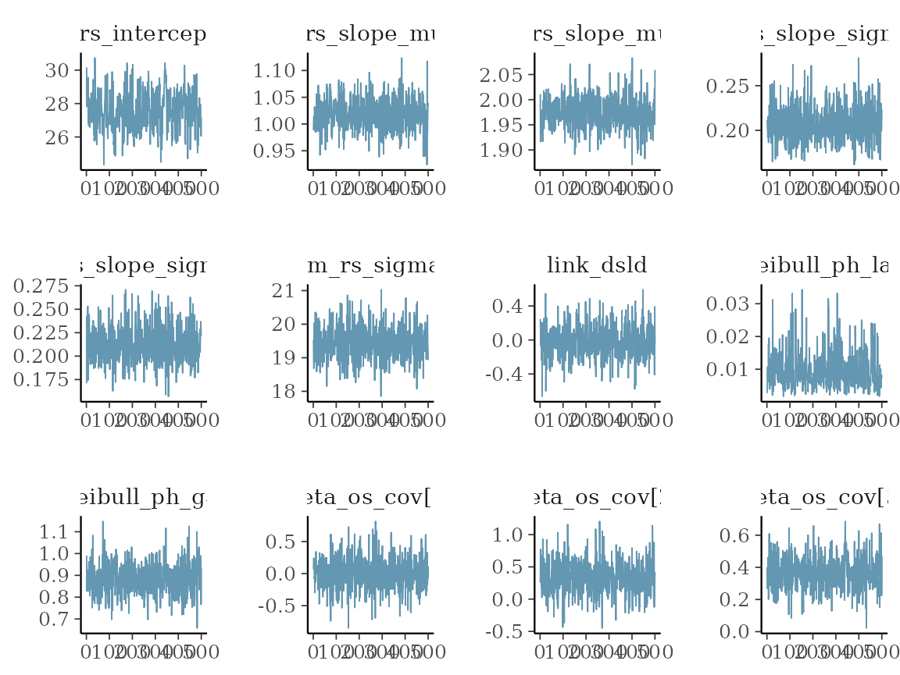
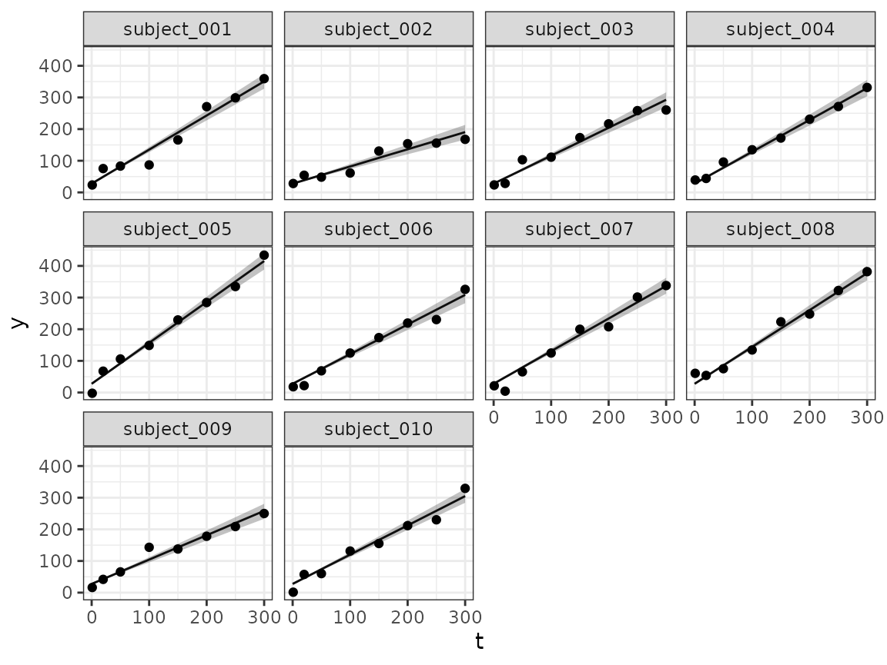
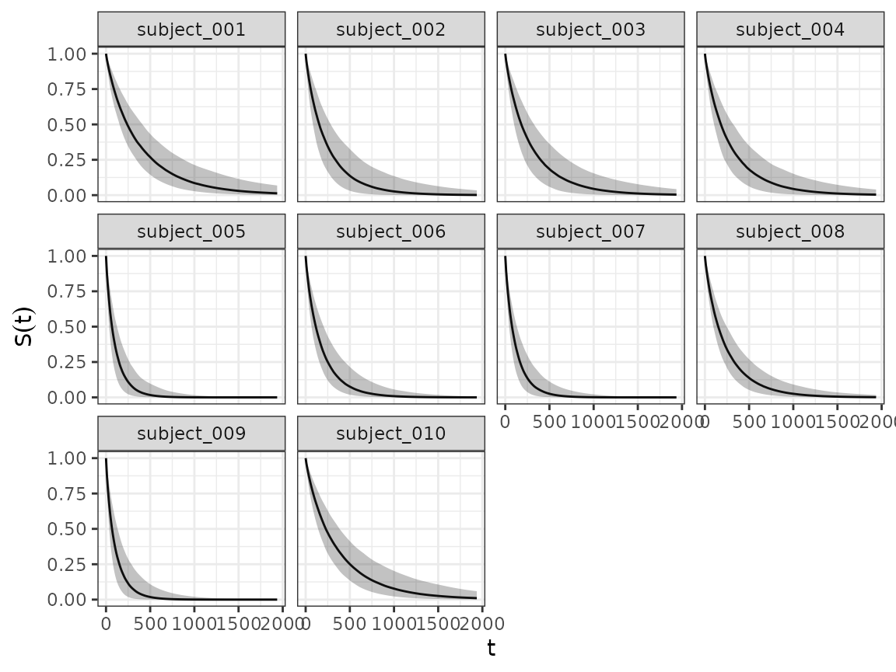
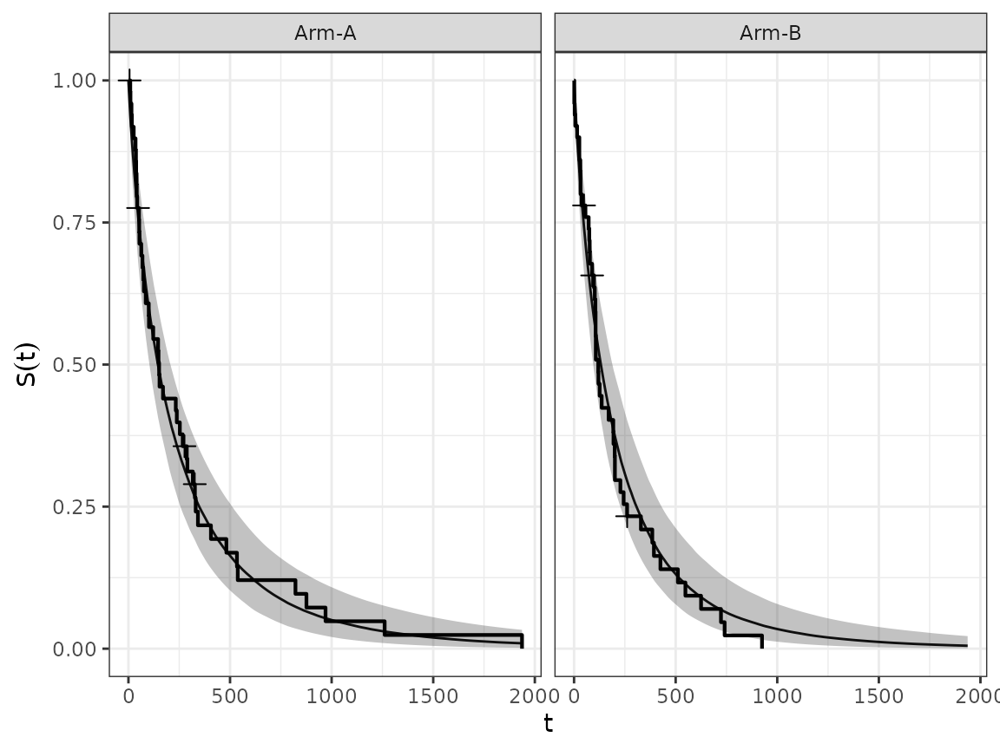
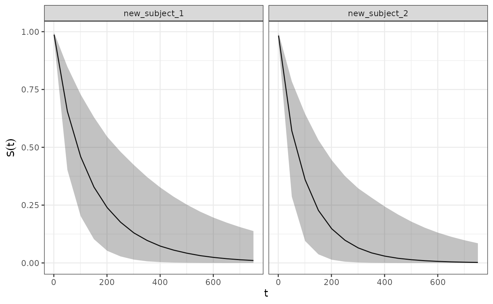

# jmpost Quickstart

## IMPORTANT

Please note that this document is currently a work-in-progress and does
not contain complete information for this package yet.

## Introduction

The `jmpost` package is used to fit joint models of time-to-event
endpoints with an association term parameterised from a longitudinal
submodel. The package was originally designed for the context of fitting
tumour growth inhibition models to inform overall survival but is not
limited to this application.

It is important to note that `jmpost` is just a wrapper on top of the
Stan programming language and leans heavily on the wider Stan ecosystem.
For example no model diagnostics are provided by `jmpost` with users
being recommended to use packages like `bayesplot` for this
functionality.

This vignette provides a basic outline of how to fit a joint model using
`jmpost`. For more detailed information on the package and its functions
please refer to the package documentation.

## Model Specification

Each `JointModel` needs to be specified with three parts:

1.  `longitudinal`: The model for the longitudinal outcomes.
2.  `survival`: The model for the survival outcomes.
3.  `link`: The link that specifies how the `longitudinal` model
    parameters enter the `survival` model.

### Default Options

Let’s first specify a very simple joint model with:

1.  A random slope model for the longitudinal outcome.
2.  A Weibull proportional hazards model for the survival outcome.
3.  The link between the two models is that the random slope from the
    longitudinal model enters as a product with a link coefficient into
    the linear predictor of the survival model.

``` r

simple_model <- JointModel(
    longitudinal = LongitudinalRandomSlope(),
    survival = SurvivalWeibullPH(),
    link = linkDSLD()
)
```

Note that here we use all the default options for the two models and the
link, in particular the prior distributions and the initial values in
the MCMC chain for the parameters are automatically chosen. We can see
this from the arguments of the constructors (or from the help page):

``` r

args(LongitudinalRandomSlope)
#> function (intercept = prior_normal(30, 10), slope_mu = prior_normal(1, 
#>     3), slope_sigma = prior_lognormal(0, 1.5), sigma = prior_lognormal(0, 
#>     1.5), scaled_variance = FALSE) 
#> NULL
```

So here we see that the Longitudinal Random Slope model has 4 parameters
that we can define a prior for.

### Specifying Priors

We can alternatively also specify the prior distributions for the
parameters manually. This is important in practice to obtain a
meaningful model specification and hence converging MCMC chains that
allow to estimate the posterior distributions.

For the random slope model for the longitudinal outcome, we can
e.g. say:

``` r

random_slope_model <- LongitudinalRandomSlope(
    intercept = prior_normal(40, 5),
    slope_mu = prior_normal(10, 2)
)
```

This sets the prior for the `intercept` to be a $`N(40, 5)`$
distribution and the prior for the `slope_mu` parameter to be a
$`N(10, 2)`$ distribution.

For the survival models, we can set different independent normal priors
for the coefficients of the covariates in the linear predictor using the
[`prior_normal_vector()`](https://genentech.github.io/jmpost/reference/prior_normal_vector.md)
specification. Here we can give a vector of the same length as the
number of design matrix columns for both the means or standard
deviations of the normal distributions, or we can give a single value
that will be repeated for all covariates. For example, say we have 3
design matrix columns, i.e. coefficients, in the linear predictor of the
survival model, then we can set the priors for these coefficients as
follows:

``` r

survival_model <- SurvivalWeibullPH(
    beta = prior_normal_vector(mus = c(-1, 0, 5), sigmas = c(1, 1, 10))
)
survival_model
#> 
#> Weibull-PH Survival Model with parameters:
#>     sm_weibull_ph_lambda ~ gamma(alpha = 2, beta = 0.5) T[0, ]
#>     sm_weibull_ph_gamma ~ gamma(alpha = 2, beta = 0.5) T[0, ]
#>     beta_os_cov ~ normal(mus = [-1, 0, 5], sigmas = [1, 1, 10])
```

In order to know which position corresponds to which design matrix
column and thus coefficient, we can use the
[`model.matrix()`](https://rdrr.io/r/stats/model.matrix.html) function
on the `DataSurvival` object. This is explained in the section
“Formatting Data” below in detail.

### Separate Models

It is also possible to not link the longitudinal and the survival
models, by using the special
[`linkNone()`](https://genentech.github.io/jmpost/reference/standard-link-user.md)
link specification. For example,

``` r

simple_model_no_link <- JointModel(
    longitudinal = LongitudinalRandomSlope(),
    survival = SurvivalWeibullPH(),
    link = linkNone()
)
```

would allow to fit the two models separately, but in the same MCMC
chain.

### Single Models

It is also possible to specify only the longitudinal or the survival
model. Then these can be estimated on their own with separate MCMC
chains.

``` r

single_longitudinal <- JointModel(
    longitudinal = LongitudinalRandomSlope()
)
single_survival <- JointModel(
    survival = SurvivalWeibullPH()
)
```

## Data Preparation

Before we can fit the models, we need to prepare the data in the right
format.

### Simulating Data

Here we start from a simulated data set.

- We assign 50 subjects each to the two treatment arms.
- We use a time grid from 1 to 2000, e.g. specifying the days after
  randomization.
- We use an exponentially distributed censoring time with mean of 9000
  days.
- We use a categorical covariate with three levels A, B and C in the
  overall survival model, drawn uniformly from the three levels. (Note
  that this is hardcoded at the moment, so the levels need to be A, B,
  C.)
- We use another continuous covariate in the overall survival model
  generated from a standard normal distribution, with coefficient 0.3.
- For the longitudinal outcome, we draw the values from a random slope
  model with the given parameters.
- For the survival outcome, we draw the true value from a Weibull model.
  Note that it is fairly easy to put here another choice, you just need
  to specify a function of `time` returning the log baseline hazard
  under the given survival model.

So let’s run the code for that:

``` r

set.seed(129)
sim_data <- SimJointData(
    design = list(
        SimGroup(50, "Arm-A", "Study-X"),
        SimGroup(50, "Arm-B", "Study-X")
    ),
    longitudinal = SimLongitudinalRandomSlope(
        times = c(1, 20, 50, 100, 150, 200, 250, 300),
        intercept = 30,
        slope_mu = c(1, 2),
        slope_sigma = 0.2,
        sigma = 20,
        link_dsld = 0.1
    ),
    survival = SimSurvivalWeibullPH(
        lambda = 1 / 300,
        gamma = 0.97,
        time_max = 2000,
        time_step = 1,
        lambda_cen = 1 / 9000,
        beta_cat = c(
            "A" = 0,
            "B" = -0.1,
            "C" = 0.5
        ),
        beta_cont = 0.3
    )
)
```

We might get a message here that a few subjects did not die before the
day 2000, but this is not of concern. Basically it just gives us a
feeling of how many survival events are included in the data set.

### Formatting Data

Next we bring the data into the right format.

We start with extracting data into individual data sets, and then
reducing the longitudinal data to specific time points.

``` r

os_data <- sim_data@survival
long_data <- sim_data@longitudinal
```

Let’s have a quick look at the format:

The survival data has:

- subject ID
- time point
- continuous covariate value
- categorical covariate level
- event indicator (1 for observed, 0 for censored)
- study ID
- treatment arm

``` r

head(os_data)
#> # A tibble: 6 × 7
#>   subject     study   arm    time cov_cont cov_cat event
#>   <chr>       <fct>   <fct> <dbl>    <dbl> <fct>   <dbl>
#> 1 subject_001 Study-X Arm-A    35   -1.12  B           1
#> 2 subject_002 Study-X Arm-A    17   -0.990 C           1
#> 3 subject_003 Study-X Arm-A   876   -1.37  C           1
#> 4 subject_004 Study-X Arm-A   100   -1.36  C           1
#> 5 subject_005 Study-X Arm-A     9    2.00  B           1
#> 6 subject_006 Study-X Arm-A   122    0.696 B           1
```

The longitudinal data has:

- subject ID
- time point
- sum of longest diameters (SLD)
- study ID
- treatment arm
- observation flag

``` r

head(long_data)
#> # A tibble: 6 × 6
#>   subject     arm   study    time   sld observed
#>   <chr>       <fct> <fct>   <dbl> <dbl> <lgl>   
#> 1 subject_001 Arm-A Study-X     1  23.4 TRUE    
#> 2 subject_001 Arm-A Study-X    20  75.3 TRUE    
#> 3 subject_001 Arm-A Study-X    50  83.1 FALSE   
#> 4 subject_001 Arm-A Study-X   100  86.8 FALSE   
#> 5 subject_001 Arm-A Study-X   150 166.  FALSE   
#> 6 subject_001 Arm-A Study-X   200 271.  FALSE
```

Finally, we wrap these in the data formatting functions. Here the
mapping of the column names to the required variables happens. This
means that in our applications we don’t have to use the same variable
names as seen above, but we can use custom names and then apply the
mapping here.

``` r

joint_data <- DataJoint(
    subject = DataSubject(
        data = os_data,
        subject = "subject",
        arm = "arm",
        study = "study"
    ),
    survival = DataSurvival(
        data = os_data,
        formula = Surv(time, event) ~ cov_cat + cov_cont
    ),
    longitudinal = DataLongitudinal(
        data = long_data,
        formula = sld ~ time,
        threshold = 5
    )
)
```

Note that we can also actively look into the design matrix of the
`DataSurvival` object. This can be helpful if we want to know which
coefficients are at which position, e.g. for setting the right prior
means and standard deviations with
[`prior_normal_vector()`](https://genentech.github.io/jmpost/reference/prior_normal_vector.md).
It works like this:

``` r

head(model.matrix(joint_data@survival))
#>      cov_catB cov_catC   cov_cont
#> [1,]        1        0 -1.1209000
#> [2,]        0        1 -0.9897245
#> [3,]        0        1 -1.3746970
#> [4,]        0        1 -1.3556451
#> [5,]        1        0  1.9967553
#> [6,]        1        0  0.6958700
```

So here we see that the first coefficient corresponds to category `B`
and the second coefficient corresponds to category `C` of the
categorical covariate `cov_cat`, while the third coefficient corresponds
to the continuous covariate `cov_cont`.

## Model Fitting

Now let’s have a look how we can fit the (joint) models.

### Debugging Stan Code

It is always possible to read out the Stan code that is contained in the
`JointModel` object, using
[`write_stan()`](https://genentech.github.io/jmpost/reference/write_stan.md):

``` r

tmp <- tempfile()
write_stan(simple_model, destination = tmp)
first_part <- head(readLines(tmp), 10)
cat(paste(first_part, collapse = "\n"))
#> functions {
#>     //
#>     // Source - base/functions.stan
#>     //
#> 
#>     // Constant used in below.
#>     real neg_log_sqrt_2_pi() {
#>         return -0.9189385332046727;
#>     }
```

### Sampling Parameters

Finally,
[`sampleStanModel()`](https://genentech.github.io/jmpost/reference/sampleStanModel.md)
is kicking off the MCMC sampler via `cmdstanr` in the backend. Note that
in practice you would increase the number of warm-up and sampling
iterations.

``` r

mcmc_results <- sampleStanModel(
    simple_model,
    data = joint_data,
    iter_sampling = 500,
    iter_warmup = 500,
    chains = 1,
    parallel_chains = 1
)
#> Running MCMC with 1 chain...
#> 
#> Chain 1 Iteration:   1 / 1000 [  0%]  (Warmup)
#> Chain 1 Informational Message: The current Metropolis proposal is about to be rejected because of the following issue:
#> Chain 1 Exception: gamma_lpdf: Random variable is inf, but must be positive finite! (in '/tmp/RtmpHRUNkY/model-c5525d719c.stan', line 499, column 4 to column 107)
#> Chain 1 If this warning occurs sporadically, such as for highly constrained variable types like covariance matrices, then the sampler is fine,
#> Chain 1 but if this warning occurs often then your model may be either severely ill-conditioned or misspecified.
#> Chain 1
#> Chain 1 Iteration: 100 / 1000 [ 10%]  (Warmup) 
#> Chain 1 Iteration: 200 / 1000 [ 20%]  (Warmup) 
#> Chain 1 Iteration: 300 / 1000 [ 30%]  (Warmup) 
#> Chain 1 Iteration: 400 / 1000 [ 40%]  (Warmup) 
#> Chain 1 Iteration: 500 / 1000 [ 50%]  (Warmup) 
#> Chain 1 Iteration: 501 / 1000 [ 50%]  (Sampling) 
#> Chain 1 Iteration: 600 / 1000 [ 60%]  (Sampling) 
#> Chain 1 Iteration: 700 / 1000 [ 70%]  (Sampling) 
#> Chain 1 Iteration: 800 / 1000 [ 80%]  (Sampling) 
#> Chain 1 Iteration: 900 / 1000 [ 90%]  (Sampling) 
#> Chain 1 Iteration: 1000 / 1000 [100%]  (Sampling) 
#> Chain 1 finished in 15.7 seconds.
```

### Convergence checks

After the sampling finishes, we can inspect the parameter distributions.
This is using the `cmdstanr` functions, because the `results` element is
of class `CmdStanMCMC`.

``` r

vars <- c(
    "lm_rs_intercept",
    "lm_rs_slope_mu",
    "lm_rs_slope_sigma",
    "lm_rs_sigma",
    "link_dsld",
    "sm_weibull_ph_lambda",
    "sm_weibull_ph_gamma",
    "beta_os_cov"
)
cmdstanr::as.CmdStanMCMC(mcmc_results)$summary(vars)
#> # A tibble: 12 × 10
#>    variable        mean   median      sd     mad       q5     q95  rhat ess_bulk
#>    <chr>          <dbl>    <dbl>   <dbl>   <dbl>    <dbl>   <dbl> <dbl>    <dbl>
#>  1 lm_rs_inte…  2.76e+1 27.6     1.19    1.25    25.7     29.6    1.00      198.
#>  2 lm_rs_slop…  1.02e+0  1.02    0.0300  0.0293   0.972    1.07   1.00      841.
#>  3 lm_rs_slop…  1.97e+0  1.97    0.0316  0.0298   1.92     2.02   1.00      574.
#>  4 lm_rs_slop…  2.08e-1  0.206   0.0209  0.0208   0.176    0.244  0.999     844.
#>  5 lm_rs_slop…  2.13e-1  0.212   0.0204  0.0205   0.182    0.249  1.00      811.
#>  6 lm_rs_sigma  1.94e+1 19.4     0.530   0.547   18.6     20.3    1.000     696.
#>  7 link_dsld   -2.38e-2 -0.0270  0.203   0.204   -0.334    0.318  1.00      478.
#>  8 sm_weibull…  9.79e-3  0.00836 0.00581 0.00471  0.00305  0.0218 1.00      320.
#>  9 sm_weibull…  8.85e-1  0.883   0.0743  0.0758   0.765    1.00   1.01      412.
#> 10 beta_os_co… -3.52e-5  0.00358 0.267   0.250   -0.427    0.439  0.998     663.
#> 11 beta_os_co…  3.37e-1  0.336   0.272   0.280   -0.116    0.762  1.00      504.
#> 12 beta_os_co…  3.67e-1  0.365   0.104   0.0995   0.194    0.548  1.00      525.
#> # ℹ 1 more variable: ess_tail <dbl>
```

We can already see here from the `rhat` statistic whether the MCMC
sampler converged - values close to 1 indicate convergence, while values
larger than 1 indicate divergence.

In general, convergence is sensitive to the choice of:

- Priors
- Initial values
- Sufficient warm-up iterations

If you don’t achieve convergence, then play around with different
choices of the above.

## Plotting

We can now proceed towards investigating the results of the MCMC chain
with plots.

### Trace plots

Using the `draws()` method on the `results` element, we can extract the
samples in a format that is understood by `bayesplot`. We can e.g. look
at some simple trace plots:

``` r

vars_draws <- cmdstanr::as.CmdStanMCMC(mcmc_results)$draws(vars)

library(bayesplot)
#> This is bayesplot version 1.15.0
#> - Online documentation and vignettes at mc-stan.org/bayesplot
#> - bayesplot theme set to bayesplot::theme_default()
#>    * Does _not_ affect other ggplot2 plots
#>    * See ?bayesplot_theme_set for details on theme setting
mcmc_trace(vars_draws)
```



### Longitudinal fit plots

Using the `longitudinal()` method we can extract the longitudinal fit
samples from the result, and then plot them for all subjects or those
that we are interested in. For illustration, we will plot here the first
10 subjects:

``` r

selected_subjects <- head(os_data$subject, 10)
long_quantities <- LongitudinalQuantities(
    mcmc_results,
    grid = GridFixed(
        subjects = selected_subjects
    )
)
as.data.frame(long_quantities) |> head()
#>         group time   values
#> 1 subject_001    0 30.16538
#> 2 subject_001    0 27.82267
#> 3 subject_001    0 29.41591
#> 4 subject_001    0 28.83954
#> 5 subject_001    0 29.46468
#> 6 subject_001    0 27.89626
summary(long_quantities) |> head()
#>         group time   median    lower    upper
#> 1 subject_001    0 27.58226 25.45642 29.92349
#> 2 subject_002    0 27.58226 25.45642 29.92349
#> 3 subject_003    0 27.58226 25.45642 29.92349
#> 4 subject_004    0 27.58226 25.45642 29.92349
#> 5 subject_005    0 27.58226 25.45642 29.92349
#> 6 subject_006    0 27.58226 25.45642 29.92349
autoplot(long_quantities)
```



### Survival fit plots

And using the
[`SurvivalQuantities()`](https://genentech.github.io/jmpost/reference/SurvivalQuantities-class.md)
method we can do the same for the estimated survival functions.

``` r

surv_quantities <- SurvivalQuantities(
    mcmc_results,
    grid = GridFixed(
        subjects = selected_subjects
    )
)
as.data.frame(surv_quantities) |> head()
#>         group time values
#> 1 subject_001    0      1
#> 2 subject_001    0      1
#> 3 subject_001    0      1
#> 4 subject_001    0      1
#> 5 subject_001    0      1
#> 6 subject_001    0      1
summary(surv_quantities) |> head()
#>         group time median lower upper
#> 1 subject_001    0      1     1     1
#> 2 subject_002    0      1     1     1
#> 3 subject_003    0      1     1     1
#> 4 subject_004    0      1     1     1
#> 5 subject_005    0      1     1     1
#> 6 subject_006    0      1     1     1
autoplot(surv_quantities)
```



We can also aggregate the estimated survival curves from groups of
subjects, using the corresponding method.

``` r

surv_quantities <- SurvivalQuantities(
    mcmc_results,
    grid = GridGrouped(
        groups = split(os_data$subject, os_data$arm)
    )
)
autoplot(surv_quantities, add_km = TRUE)
```



### Predicting Survival Quantities for Hypothetical Subjects

The
[`SurvivalQuantities()`](https://genentech.github.io/jmpost/reference/SurvivalQuantities-class.md)
method can also be used to predict survival quantities for hypothetical
subjects with any arbitrary covariate and longitudinal model parameter
values. This is done via passing a
[`GridPrediction()`](https://genentech.github.io/jmpost/reference/Grid-Functions.md)
object to the method where the `newdata` and `params` arguments are used
to specify the desired values for the covariates and longitudinal model
parameters respectively. For example below we use these functions to
predict the survival distribution for a hypothetical subject:

``` r

surv_quantities <- SurvivalQuantities(
    mcmc_results,
    grid = GridPrediction(
        times = seq(1, 800, by = 50),
        newdata = dplyr::tibble(
            cov_cat = c("A", "B"),
            cov_cont = c(1.2, 2)
        ),
        params = list(
            intercept = 40,
            slope = 0.05
        )
    )
)
autoplot(surv_quantities)
```



The exact names that are required for the `params` argument (i.e. the
longitudinal model parameters) can be found by running
[`getPredictionNames()`](https://genentech.github.io/jmpost/reference/getPredictionNames.md)
on the longitudinal model object. For example:

``` r

getPredictionNames(LongitudinalGSF())
#> [1] "b"   "s"   "g"   "phi"
```

### Brier Score

The
[`brierScore()`](https://genentech.github.io/jmpost/reference/brierScore.md)
method can be used to extract the Brier Scores (predictive performance
measure) from our `SurvivalQuantities` object.

``` r

sq <- SurvivalQuantities(
    mcmc_results,
    grid = GridFixed(times = c(1, 50, 100, 400, 800)),
    type = "surv"
)
brierScore(sq)
#>          1         50        100        400        800 
#> 0.01949617 0.17228589 0.23846209 0.14912514 0.06095365
```

### Initial Values

By default `jmpost` will set the initial values for all parameters to be
a random value drawn from the prior distribution that has been shrunk
towards the mean of said distribution e.g. for a `prior_normal(4, 2)`
the initial value for each chain will be:

    4 * shrinkage_factor + rnorm(1, 4, 2) * (1 - shrinkage_factor)

Note that the shrinkage factor is set to 0.5 by default and can be
changed via the `jmpost.prior_shrinkage` option e.g.

    options("jmpost.prior_shrinkage" = 0.7)

If you wish to manually specify the initial values you can do so via the
[`initialValues()`](https://genentech.github.io/jmpost/reference/initialValues.md)
function. For example:

``` r

joint_model <- JointModel(
    longitudinal = LongitudinalRandomSlope(),
    survival = SurvivalExponential(),
    link = linkNone()
)
initial_values <- initialValues(joint_model, n_chains = 2)

initial_values[[1]]$lm_rs_intercept <- 0.2
initial_values[[2]]$lm_rs_intercept <- 0.3

mcmc_results <- sampleStanModel(
    joint_model,
    data = DataJoint(...),
    init = initial_values,
    chains = 2
)
```

Note the following: -
[`initialValues()`](https://genentech.github.io/jmpost/reference/initialValues.md)
will return a list of lists where each sublist contains the initial
values for the corresponding chain index. -
[`initialValues()`](https://genentech.github.io/jmpost/reference/initialValues.md)
by default just returns 1 initial value for each parameter; the
[`sampleStanModel()`](https://genentech.github.io/jmpost/reference/sampleStanModel.md)
function will then broadcast this number as many times as required
e.g. if you have 3 covariates in your survival model then the initial
value for the Beta coeficient will be repeated 3 times. If however you
want to specify individual initial values for each covariate you can do
so by passing in a vector of the same length as the number of
covariates. -
[`initialValues()`](https://genentech.github.io/jmpost/reference/initialValues.md)
will not check if the proposed values are valid for constrained
parameters. That is, if you are using a `prior_cauchy(0, 1)` prior for a
parameter that should be `>0` then you will need to manually set the
initial value (as described above) to ensure that it is a valid value. -
For constrained parameters (e.g. variance parameters that must be
$`> 0`$)
[`initialValues()`](https://genentech.github.io/jmpost/reference/initialValues.md)
will continuously sample and discard initial values until it generates
one that meet the constraints. If after 100 attempts no valid initial
value has been found then it will throw an error.
