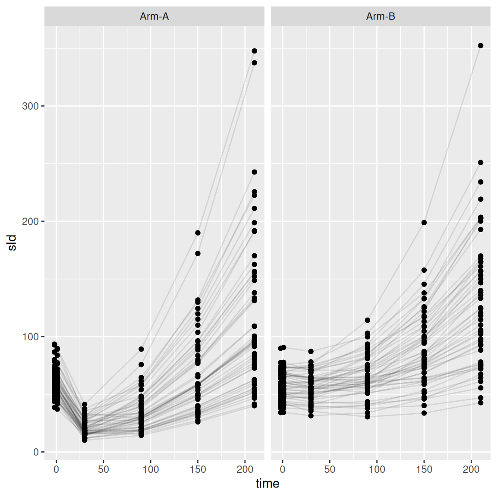
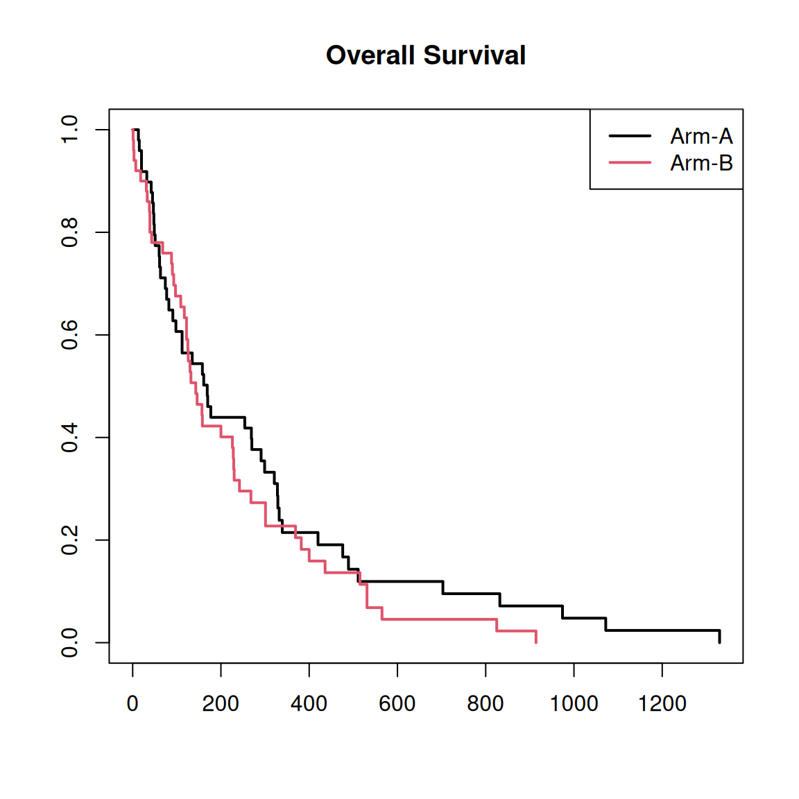
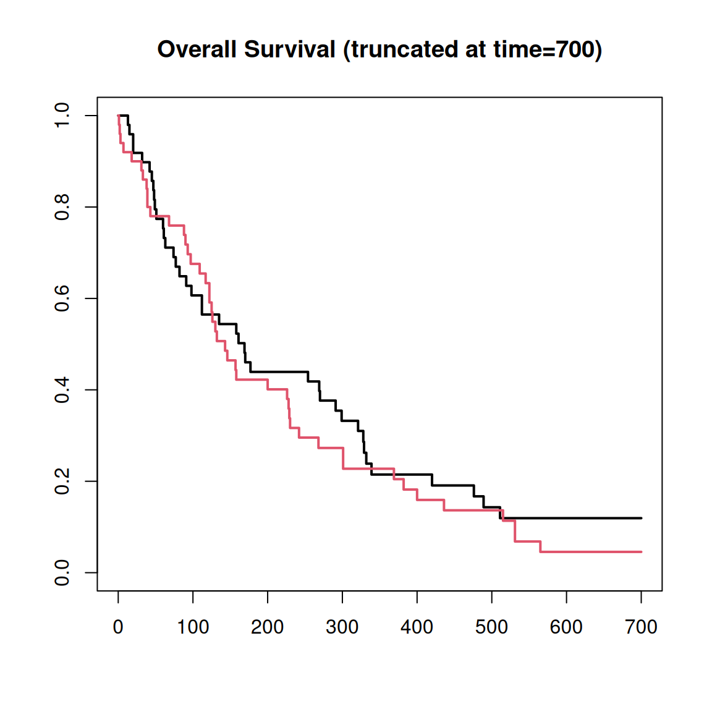
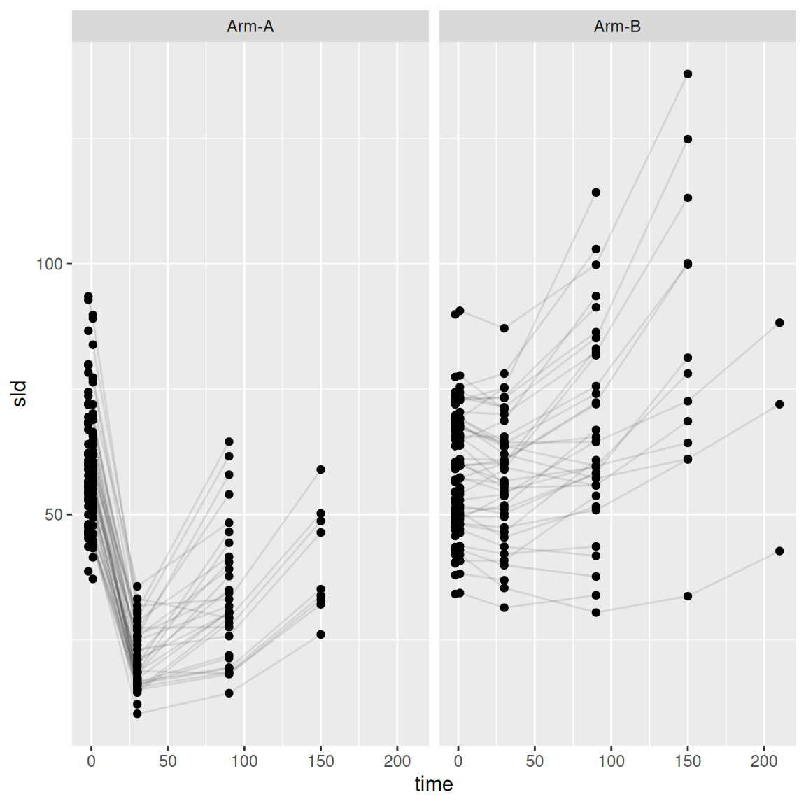
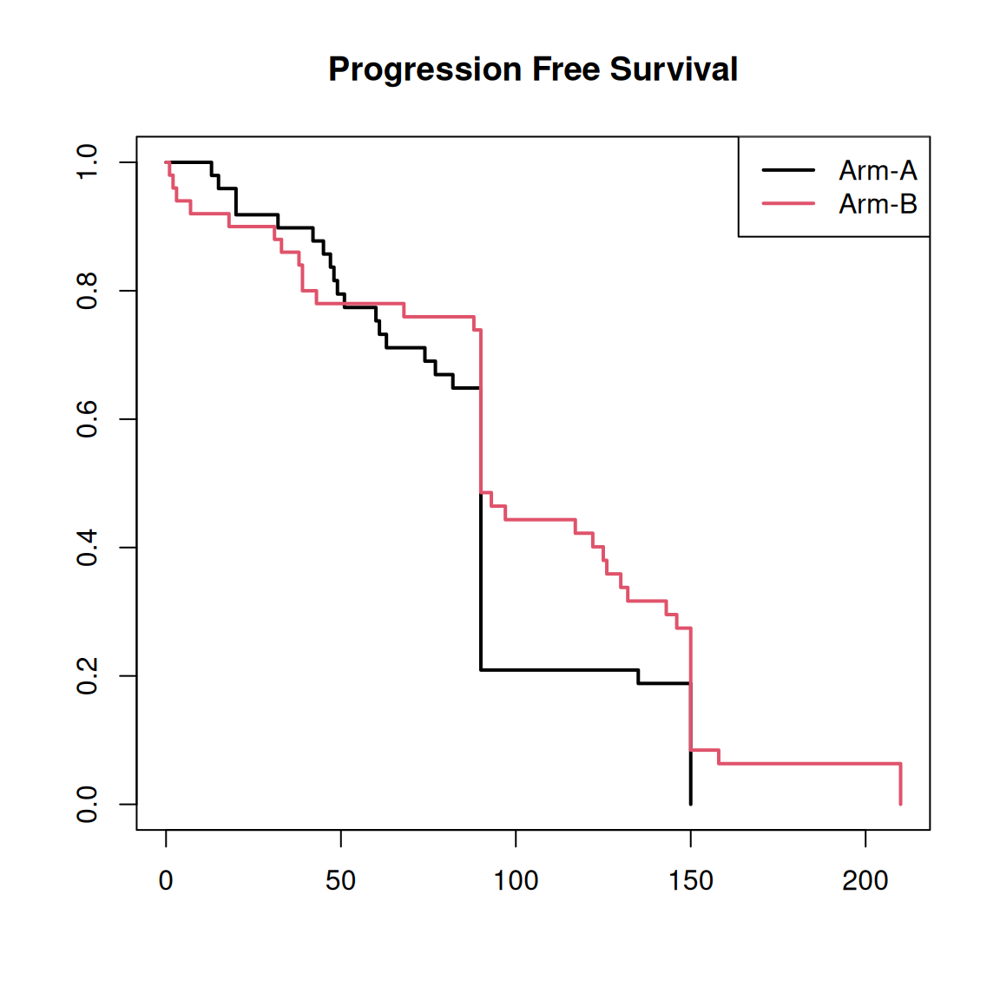
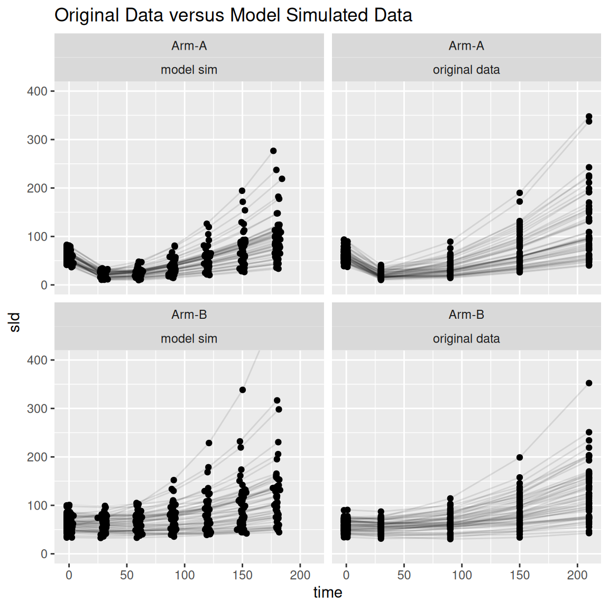
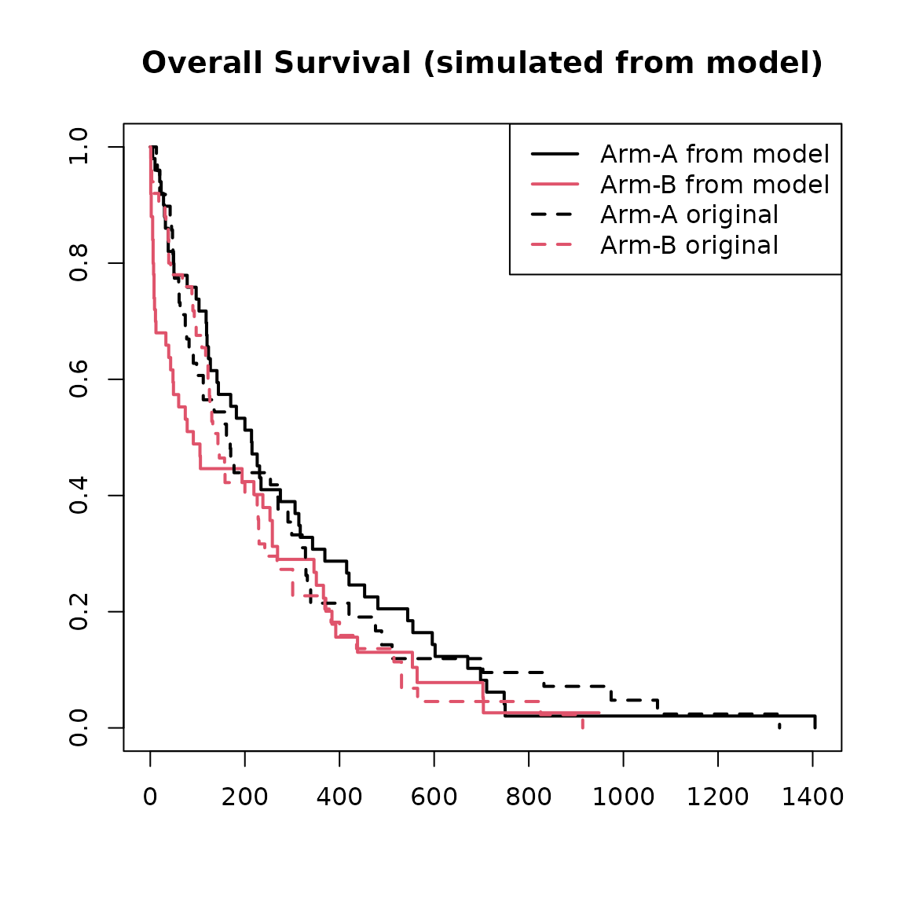

# Simulating Data

[`library`](https://rdrr.io/r/base/library.html)`(`[`jmpost`](https://genentech.github.io/jmpost/)`)`` ``#> Registered S3 methods overwritten by 'ggpp':`` ``#> method from `` ``#> heightDetails.titleGrob ggplot2`` ``#> widthDetails.titleGrob ggplot2`` ``#> CmdStan path set to: /root/.cmdstan/cmdstan-2.39.0`

The `jmpost` package includes data simulation functionality for the
included joint models. The data simulation is based on specifying the
longitudinal model and the survival model including link parameters.

## Example

[`set.seed`](https://rdrr.io/r/base/Random.html)`(``129``)`` ``sim_data`` ``<-`` `[`SimJointData`](https://genentech.github.io/jmpost/reference/SimJointData-class.md)`(`` `` design ``=`` `[`list`](https://rdrr.io/r/base/list.html)`(`` `` `[`SimGroup`](https://genentech.github.io/jmpost/reference/SimGroup-class.md)`(``50``, ``"Arm-A"``, ``"Study-X"``)``,`` `` `[`SimGroup`](https://genentech.github.io/jmpost/reference/SimGroup-class.md)`(``50``, ``"Arm-B"``, ``"Study-X"``)`` `` ``)``,`` `` longitudinal ``=`` `[`SimLongitudinalSteinFojo`](https://genentech.github.io/jmpost/reference/SimLongitudinalSteinFojo-class.md)`(`` `` times ``=`` `[`c`](https://rdrr.io/r/base/c.html)`(``-``2``, ``1``, ``30``, ``90``, ``150``, ``210``)``,`` `` mu_g ``=`` `[`log`](https://rdrr.io/r/base/Log.html)`(`[`c`](https://rdrr.io/r/base/c.html)`(``0.005``, ``0.005``)``)``,`` `` mu_s ``=`` `[`log`](https://rdrr.io/r/base/Log.html)`(`[`c`](https://rdrr.io/r/base/c.html)`(``0.06``, ``0.007``)``)``,`` `` omega_g ``=`` ``0.3``,`` `` link_dsld ``=`` ``0.1``,`` `` ``)``,`` `` survival ``=`` `[`SimSurvivalWeibullPH`](https://genentech.github.io/jmpost/reference/SimSurvivalWeibullPH.md)`(`` `` lambda ``=`` ``1`` ``/`` ``300``,`` `` gamma ``=`` ``0.97``,`` `` time_max ``=`` ``2000``,`` `` time_step ``=`` ``1``,`` `` lambda_cen ``=`` ``1`` ``/`` ``9000``,`` `` beta_cat ``=`` `[`c`](https://rdrr.io/r/base/c.html)`(`` `` ``"A"`` ``=`` ``0``,`` `` ``"B"`` ``=`` ``-``0.1``,`` `` ``"C"`` ``=`` ``0.5`` `` ``)``,`` `` beta_cont ``=`` ``0.3`` `` ``)`` ``)`

This object has `survival` and `longitudinal` components.

[`head`](https://rdrr.io/r/utils/head.html)`(``sim_data``@``survival``)`` ``#> # A tibble: 6 × 7`` ``#> subject study arm time cov_cont cov_cat event`` ``#> <chr> <fct> <fct> <dbl> <dbl> <fct> <dbl>`` ``#> 1 subject_001 Study-X Arm-A 42 -1.12 B 1`` ``#> 2 subject_002 Study-X Arm-A 20 -0.990 C 1`` ``#> 3 subject_003 Study-X Arm-A 832 -1.37 C 1`` ``#> 4 subject_004 Study-X Arm-A 112 -1.36 C 1`` ``#> 5 subject_005 Study-X Arm-A 13 2.00 B 1`` ``#> 6 subject_006 Study-X Arm-A 135 0.696 B 1`` `[`head`](https://rdrr.io/r/utils/head.html)`(``sim_data``@``longitudinal``)`` ``#> # A tibble: 6 × 6`` ``#> subject arm study time sld observed`` ``#> <chr> <fct> <fct> <dbl> <dbl> <lgl> `` ``#> 1 subject_001 Arm-A Study-X -2 64.0 TRUE `` ``#> 2 subject_001 Arm-A Study-X 1 61.9 TRUE `` ``#> 3 subject_001 Arm-A Study-X 30 27.7 TRUE `` ``#> 4 subject_001 Arm-A Study-X 90 58.9 FALSE `` ``#> 5 subject_001 Arm-A Study-X 150 124. FALSE `` ``#> 6 subject_001 Arm-A Study-X 210 226. FALSE`

We can see the trajectory of the tumour size.

[`library`](https://rdrr.io/r/base/library.html)`(`[`ggplot2`](https://ggplot2.tidyverse.org)`)`` `[`ggplot`](https://ggplot2.tidyverse.org/reference/ggplot.html)`(`` `` ``sim_data``@``longitudinal``,`` `` `[`aes`](https://ggplot2.tidyverse.org/reference/aes.html)`(``x ``=`` ``time``, y ``=`` ``sld``, group ``=`` ``subject``)`` ``)`` ``+`` `` `[`geom_line`](https://ggplot2.tidyverse.org/reference/geom_path.html)`(``alpha ``=`` ``0.1``)`` ``+`` `` `[`geom_point`](https://ggplot2.tidyverse.org/reference/geom_point.html)`(``)`` ``+`` `` `[`facet_wrap`](https://ggplot2.tidyverse.org/reference/facet_wrap.html)`(``~``arm``)`

We can also visualise the Kaplan-Meier survival curves.

[`library`](https://rdrr.io/r/base/library.html)`(`[`survival`](https://github.com/therneau/survival)`)`` `[`plot`](https://rdrr.io/r/graphics/plot.default.html)`(`` `` `[`survfit`](https://rdrr.io/pkg/survival/man/survfit.html)`(`[`Surv`](https://genentech.github.io/jmpost/reference/Surv.md)`(``time``, ``event``)`` ``~`` ``arm``, data ``=`` ``sim_data``@``survival``)``,`` `` col ``=`` ``1``:``2``,`` `` lwd ``=`` ``2``,`` `` main ``=`` ``"Overall Survival"`` ``)`` `[`legend`](https://rdrr.io/r/graphics/legend.html)`(``"topright"``, col ``=`` ``1``:``2``, lwd ``=`` ``2``, legend ``=`` `[`c`](https://rdrr.io/r/base/c.html)`(``"Arm-A"``, ``"Arm-B"``)``)`

## Administrative Cut Off

We may wish to have a fixed maximum study duration and remove any
simulated values after that time. This can be specified as a single
fixed value or as a vector if we additionally wish to consider enrolment
time.

`sim_data_end`` ``<-`` `[`cut_data`](https://genentech.github.io/jmpost/reference/cut_data.md)`(``sim_data``, ``700``)`` `[`plot`](https://rdrr.io/r/graphics/plot.default.html)`(`` `` `[`survfit`](https://rdrr.io/pkg/survival/man/survfit.html)`(`[`Surv`](https://genentech.github.io/jmpost/reference/Surv.md)`(``time``, ``event``)`` ``~`` ``arm``, data ``=`` ``sim_data_end``@``survival``)``,`` `` col ``=`` ``1``:``2``,`` `` lwd ``=`` ``2``,`` `` main ``=`` ``"Overall Survival (truncated at time=700)"`` ``)`

## Progression

We might also be interested in time to progression defined as an
increase in tumour size over a threshold. The threshold is based on the
minimum observed SLD up to the given time and the relative and absolute
growth. For example we might require the SLD to increase at least 20%
and at least 5mm. We don’t include any observations before time 0 in the
calculation of the minimum and we don’t observe any SLD values after
progression.

`sim_data_pd`` ``<-`` `[`add_pfs`](https://genentech.github.io/jmpost/reference/add_pfs.md)`(`` `` ``sim_data_end``,`` `` relative_threshold ``=`` ``1.2``,`` `` absolute_threshold ``=`` ``5``,`` `` from_time ``=`` ``0``,`` `` observed_after ``=`` ``FALSE`` ``)`

Let’s look at the plots again up to progression.

[`ggplot`](https://ggplot2.tidyverse.org/reference/ggplot.html)`(`` `` ``sim_data_pd``@``longitudinal`` ``|>`` ``dplyr``::`[`filter`](https://dplyr.tidyverse.org/reference/filter.html)`(``observed``)``, ``# here we only include observed values`` `` `[`aes`](https://ggplot2.tidyverse.org/reference/aes.html)`(``x ``=`` ``time``, y ``=`` ``sld``, group ``=`` ``subject``)`` ``)`` ``+`` `` `[`geom_line`](https://ggplot2.tidyverse.org/reference/geom_path.html)`(``alpha ``=`` ``0.1``)`` ``+`` `` `[`geom_point`](https://ggplot2.tidyverse.org/reference/geom_point.html)`(``)`` ``+`` `` `[`facet_wrap`](https://ggplot2.tidyverse.org/reference/facet_wrap.html)`(``~``arm``)`

[`plot`](https://rdrr.io/r/graphics/plot.default.html)`(`` `` `[`survfit`](https://rdrr.io/pkg/survival/man/survfit.html)`(`[`Surv`](https://genentech.github.io/jmpost/reference/Surv.md)`(``pfs_time``, ``pfs_event``)`` ``~`` ``arm``, data ``=`` ``sim_data_pd``@``survival``)``,`` `` col ``=`` ``1``:``2``,`` `` lwd ``=`` ``2``,`` `` main ``=`` ``"Progression Free Survival"`` ``)`` `[`legend`](https://rdrr.io/r/graphics/legend.html)`(``"topright"``, col ``=`` ``1``:``2``, lwd ``=`` ``2``, legend ``=`` `[`c`](https://rdrr.io/r/base/c.html)`(``"Arm-A"``, ``"Arm-B"``)``)`

## Model Fitting from Simulated Data

As already descried in the quick start vignette, we can use this data to
fit a joint model.

`os_data`` ``<-`` ``sim_data_end``@``survival`` ``long_data`` ``<-`` ``sim_data_end``@``longitudinal`` ``joint_data`` ``<-`` `[`DataJoint`](https://genentech.github.io/jmpost/reference/DataJoint-class.md)`(`` `` subject ``=`` `[`DataSubject`](https://genentech.github.io/jmpost/reference/DataSubject-class.md)`(`` `` data ``=`` ``os_data``,`` `` subject ``=`` ``"subject"``,`` `` arm ``=`` ``"arm"``,`` `` study ``=`` ``"study"`` `` ``)``,`` `` survival ``=`` `[`DataSurvival`](https://genentech.github.io/jmpost/reference/DataSurvival-class.md)`(`` `` data ``=`` ``os_data``,`` `` formula ``=`` `[`Surv`](https://genentech.github.io/jmpost/reference/Surv.md)`(``time``, ``event``)`` ``~`` ``cov_cat`` ``+`` ``cov_cont`` `` ``)``,`` `` longitudinal ``=`` `[`DataLongitudinal`](https://genentech.github.io/jmpost/reference/DataLongitudinal-class.md)`(`` `` data ``=`` ``long_data``,`` `` formula ``=`` ``sld`` ``~`` ``time``,`` `` threshold ``=`` ``5`` `` ``)`` ``)`` `` `` ``sf_model`` ``<-`` `[`JointModel`](https://genentech.github.io/jmpost/reference/JointModel-class.md)`(`` `` longitudinal ``=`` `[`LongitudinalSteinFojo`](https://genentech.github.io/jmpost/reference/LongitudinalSteinFojo-class.md)`(`` `` mu_bsld ``=`` `[`prior_normal`](https://genentech.github.io/jmpost/reference/prior_normal.md)`(`[`log`](https://rdrr.io/r/base/Log.html)`(``60``)``, ``0.2``)``,`` `` mu_ks ``=`` `[`prior_normal`](https://genentech.github.io/jmpost/reference/prior_normal.md)`(``-``3``, ``0.4``)``,`` `` mu_kg ``=`` `[`prior_normal`](https://genentech.github.io/jmpost/reference/prior_normal.md)`(`[`log`](https://rdrr.io/r/base/Log.html)`(``0.005``)``, ``0.3``)``,`` `` centred ``=`` ``TRUE`` `` ``)``,`` `` survival ``=`` `[`SurvivalWeibullPH`](https://genentech.github.io/jmpost/reference/SurvivalWeibullPH-class.md)`(``)``,`` `` link ``=`` `[`linkDSLD`](https://genentech.github.io/jmpost/reference/standard-link-user.md)`(``)`` ``)`

[`set.seed`](https://rdrr.io/r/base/Random.html)`(``202671``)`` ``mcmc_results`` ``<-`` `[`sampleStanModel`](https://genentech.github.io/jmpost/reference/sampleStanModel.md)`(`` `` ``sf_model``,`` `` data ``=`` ``joint_data``,`` `` iter_sampling ``=`` ``1000``,`` `` iter_warmup ``=`` ``500``,`` `` chains ``=`` ``4``,`` `` parallel_chains ``=`` ``4``,`` `` step_size ``=`` ``0.01`` ``)`

`knitr``::`[`kable`](https://rdrr.io/pkg/knitr/man/kable.html)`(`` `` ``mcmc_results``@``results``$``summary``(`` `` `[`c`](https://rdrr.io/r/base/c.html)`(``"lm_sf_mu_bsld"``, ``"lm_sf_mu_ks"``, ``"lm_sf_mu_kg"``, ``"lm_sf_omega_bsld"``, ``"lm_sf_omega_ks"``, ``"lm_sf_omega_ks"``)`` `` ``)``,`` `` digits ``=`` ``3`` ``)`

| variable | mean | median | sd | mad | q5 | q95 | rhat | ess_bulk | ess_tail |
|:---|---:|---:|---:|---:|---:|---:|---:|---:|---:|
| lm_sf_mu_bsld\[1\] | 4.080 | 4.080 | 0.021 | 0.021 | 4.046 | 4.116 | 1.003 | 655.155 | 1150.529 |
| lm_sf_mu_ks\[1\] | -2.866 | -2.866 | 0.026 | 0.025 | -2.910 | -2.824 | 1.005 | 493.669 | 582.824 |
| lm_sf_mu_ks\[2\] | -4.975 | -4.975 | 0.028 | 0.029 | -5.023 | -4.928 | 1.003 | 461.255 | 764.489 |
| lm_sf_mu_kg\[1\] | -5.374 | -5.374 | 0.045 | 0.044 | -5.448 | -5.298 | 1.006 | 318.105 | 751.021 |
| lm_sf_mu_kg\[2\] | -5.337 | -5.337 | 0.044 | 0.043 | -5.412 | -5.266 | 1.008 | 416.516 | 681.971 |
| lm_sf_omega_bsld\[1\] | 0.207 | 0.206 | 0.014 | 0.014 | 0.186 | 0.232 | 1.010 | 527.880 | 1136.191 |
| lm_sf_omega_ks\[1\] | 0.185 | 0.183 | 0.019 | 0.019 | 0.157 | 0.217 | 1.010 | 376.374 | 960.140 |
| lm_sf_omega_ks\[2\] | 0.209 | 0.208 | 0.021 | 0.021 | 0.177 | 0.245 | 1.013 | 206.574 | 526.991 |

## Simulating from a Fitted Model

The package also have the functionality to generate new data based on
the fitted model. We use the \[simulate.JointModelSamples\] function.

`?``simulate.JointModelSamples`` `[`set.seed`](https://rdrr.io/r/base/Random.html)`(``198802``)`` ``new_model_data`` ``<-`` `[`simulate`](https://rdrr.io/r/stats/simulate.html)`(`` `` ``mcmc_results``,`` `` times ``=`` `[`c`](https://rdrr.io/r/base/c.html)`(``-``2``, ``1``, ``30``, ``60``, ``90``, ``120``, ``150``, ``180``)``,`` `` jitter_var ``=`` `[`c`](https://rdrr.io/r/base/c.html)`(``0``, ``2``)`` ``)`

For this simulation we set

- the times we wish to have longitudinal observations
- variance for jitter around those observation times
- time_max and time_step for numerical integration
- lambda parameter for exponential censoring times
- scaled_variance which should be set to the same as the fitted model.
  This is described more in the statistical specifications vignette.

Now we can inspect the new simulated data.

[`head`](https://rdrr.io/r/utils/head.html)`(``new_model_data``@``longitudinal``)`` ``#> subject arm study time sld observed`` ``#> 1 subject_001 Arm-A Study-X -2.000000 51.40883 TRUE`` ``#> 2 subject_001 Arm-A Study-X 1.092538 49.43356 TRUE`` ``#> 3 subject_001 Arm-A Study-X 31.020617 18.29308 TRUE`` ``#> 4 subject_001 Arm-A Study-X 60.795321 15.55358 TRUE`` ``#> 5 subject_001 Arm-A Study-X 91.002436 20.51844 TRUE`` ``#> 6 subject_001 Arm-A Study-X 120.535991 27.88200 TRUE`` `[`head`](https://rdrr.io/r/utils/head.html)`(``new_model_data``@``survival``)`` ``#> # A tibble: 6 × 7`` ``#> subject study arm time event cov_cat cov_cont`` ``#> <fct> <fct> <fct> <dbl> <dbl> <fct> <dbl>`` ``#> 1 subject_001 Study-X Arm-A 369 1 B -1.12 `` ``#> 2 subject_002 Study-X Arm-A 200 1 C -0.990`` ``#> 3 subject_003 Study-X Arm-A 170 1 C -1.37 `` ``#> 4 subject_004 Study-X Arm-A 481 1 C -1.36 `` ``#> 5 subject_005 Study-X Arm-A 20 1 B 2.00 `` ``#> 6 subject_006 Study-X Arm-A 182 1 B 0.696`

[`ggplot`](https://ggplot2.tidyverse.org/reference/ggplot.html)`(`` `` ``dplyr``::`[`bind_rows`](https://dplyr.tidyverse.org/reference/bind_rows.html)`(`` `` ``"model sim"`` ``=`` ``new_model_data``@``longitudinal``,`` `` ``"original data"`` ``=`` ``sim_data``@``longitudinal``,`` `` .id ``=`` ``"sim"`` `` ``)``,`` `` `[`aes`](https://ggplot2.tidyverse.org/reference/aes.html)`(``x ``=`` ``time``, y ``=`` ``sld``, group ``=`` ``subject``)`` ``)`` ``+`` `` `[`geom_line`](https://ggplot2.tidyverse.org/reference/geom_path.html)`(``alpha ``=`` ``0.1``)`` ``+`` `` `[`geom_point`](https://ggplot2.tidyverse.org/reference/geom_point.html)`(``)`` ``+`` `` `[`facet_wrap`](https://ggplot2.tidyverse.org/reference/facet_wrap.html)`(``~`` ``arm`` ``+`` ``sim``)`` ``+`` `` `[`coord_cartesian`](https://ggplot2.tidyverse.org/reference/coord_cartesian.html)`(``ylim ``=`` `[`c`](https://rdrr.io/r/base/c.html)`(``0``, ``400``)``)`` ``+`` `` `[`ggtitle`](https://ggplot2.tidyverse.org/reference/labs.html)`(``"Original Data versus Model Simulated Data"``)`

[`plot`](https://rdrr.io/r/graphics/plot.default.html)`(`` `` `[`survfit`](https://rdrr.io/pkg/survival/man/survfit.html)`(`[`Surv`](https://genentech.github.io/jmpost/reference/Surv.md)`(``time``, ``event``)`` ``~`` ``arm``, data ``=`` ``new_model_data``@``survival``)``,`` `` col ``=`` ``1``:``2``,`` `` lwd ``=`` ``2``,`` `` main ``=`` ``"Overall Survival (simulated from model)"`` ``)`` `[`lines`](https://rdrr.io/r/graphics/lines.html)`(`` `` `[`survfit`](https://rdrr.io/pkg/survival/man/survfit.html)`(`[`Surv`](https://genentech.github.io/jmpost/reference/Surv.md)`(``time``, ``event``)`` ``~`` ``arm``, data ``=`` ``sim_data``@``survival``)``,`` `` col ``=`` ``1``:``2``,`` `` lwd ``=`` ``2``,`` `` lty ``=`` ``2`` ``)`` `[`legend`](https://rdrr.io/r/graphics/legend.html)`(``"topright"``,`` `` col ``=`` `[`c`](https://rdrr.io/r/base/c.html)`(``1``, ``2``, ``1``, ``2``)``, lwd ``=`` ``2``, lty ``=`` `[`c`](https://rdrr.io/r/base/c.html)`(``1``, ``1``, ``2``, ``2``)``,`` `` legend ``=`` `[`c`](https://rdrr.io/r/base/c.html)`(``"Arm-A from model"``, ``"Arm-B from model"``, ``"Arm-A original"``, ``"Arm-B original"``)`` ``)`

